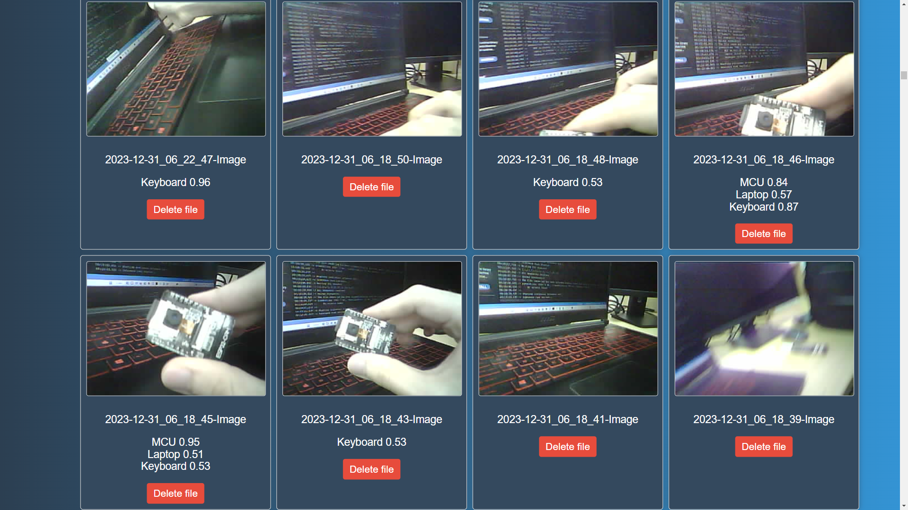
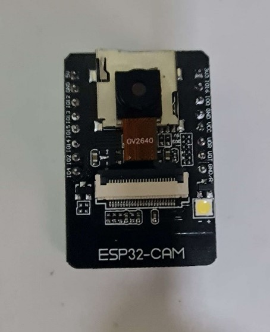

# Embedded Project

## Project Overview

This project enables object detection on the ESP32-CAM. Captured images are preprocessed, object detection is performed using a TensorFlow Lite model trained with Edge Impulse, and the results are sent to a local PHP server for display on a webpage.

## Screenshots

### Web Interface

<!--  -->

### ESP32-CAM Module

<!--  -->

## Features

- **Capture Images:** Use the ESP32-CAM to capture images.
- **Preprocess Images:** Preprocess the captured images with TensorFlow Lite.
- **Object Detection:** Perform object detection using TensorFlow Lite.
- **Post Results:** Send the results to a local PHP server.
- **Display Results:** Show the results on a webpage with the confidence percentage.

## Technologies Used

- [**ESP32-CAM:**](https://www.espressif.com/en/products/modules/esp32-cam) A low-cost development board with an integrated camera.
- [**TensorFlow Lite:**](https://www.tensorflow.org/lite) A lightweight framework for machine learning inference on microcontrollers.
- [**Edge Impulse:**](https://www.edgeimpulse.com/) A platform for training and deploying machine learning models on edge devices.
- [**PlatformIO:**](https://platformio.org/) Arguably the best IDE for embedded development.
- [**FreeRTOS:**](https://www.freertos.org/) A real-time operating system kernel for embedded devices.